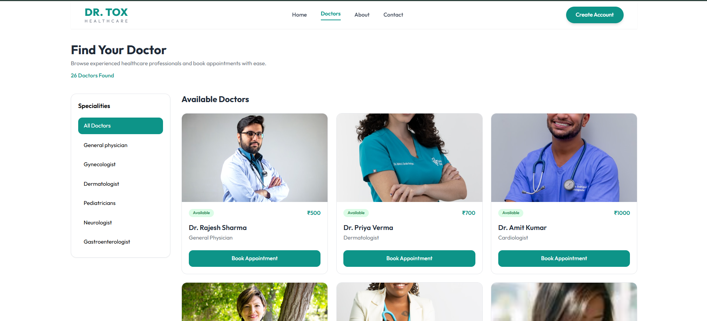
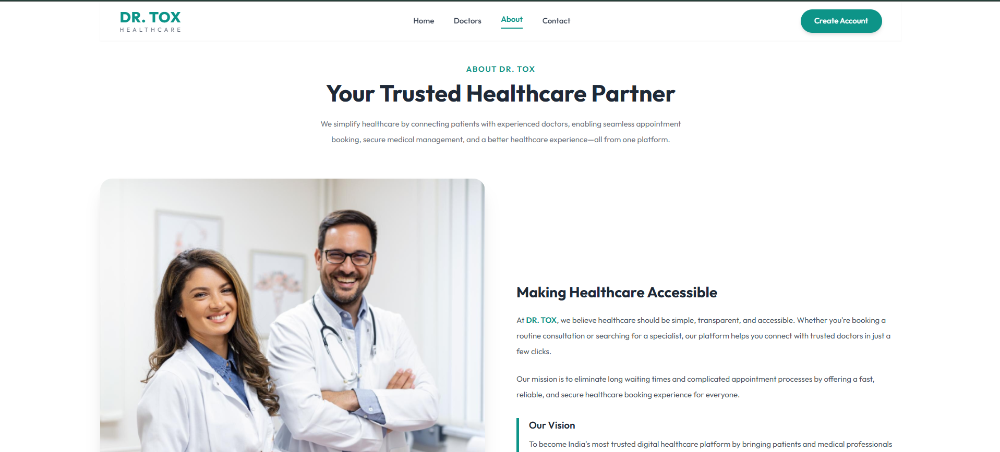
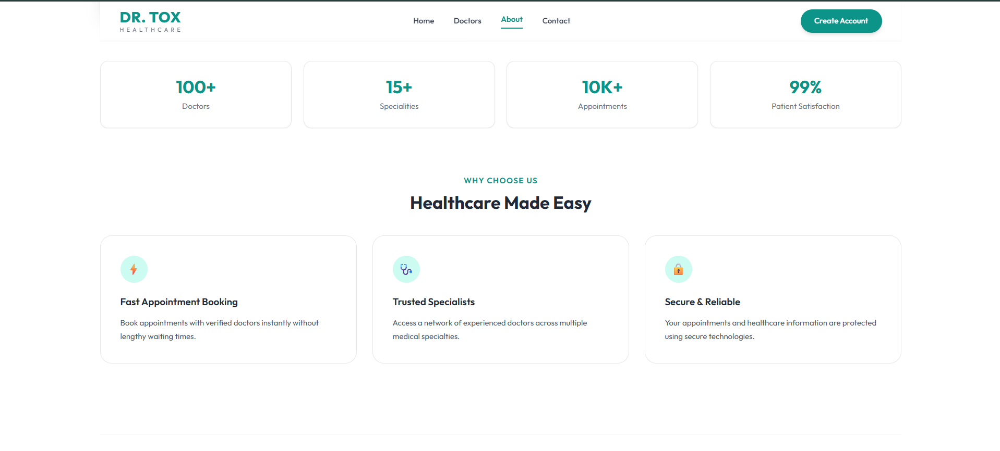
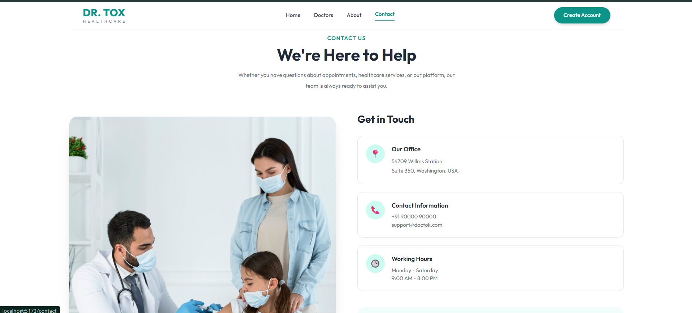
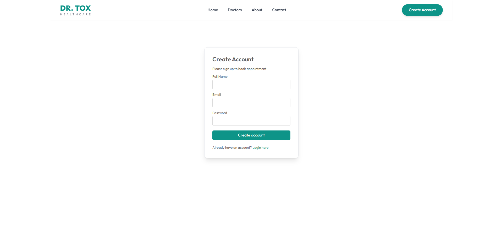
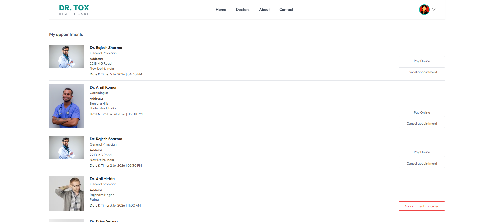
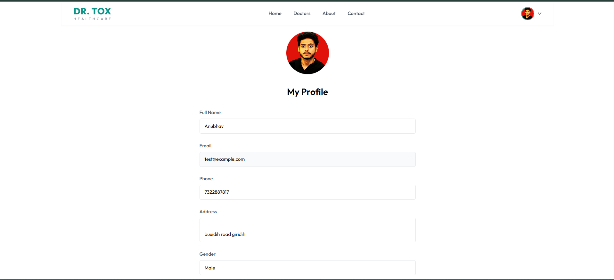

# 🏥 DOCTOR-TOX

A modern full-stack healthcare appointment booking platform that enables patients to book appointments online while allowing doctors and admins to efficiently manage healthcare services.

---

## 🚀 Features

### 👨‍⚕️ Patient Portal
- User Registration & Login
- Secure Authentication
- Browse Doctors by Specialty
- Search Doctors
- Book Appointments
- View Upcoming Appointments
- Cancel Appointments
- Manage User Profile
- Upload Profile Picture

---

### 👨‍⚕️ Doctor Dashboard
- Doctor Login
- View Dashboard Statistics
- Manage Profile
- View Patient Appointments
- Update Availability
- Accept/Reject Appointments
- Earnings Overview

---

### 👨‍💼 Admin Dashboard
- Admin Authentication
- Dashboard Analytics
- Add New Doctors
- Manage Doctor Details
- View All Appointments
- Manage Users
- Monitor Platform Activities

---

## 🛠 Tech Stack

### Frontend
- React.js
- React Router DOM
- Tailwind CSS
- Axios
- React Toastify

### Backend
- Node.js
- Express.js
- MongoDB
- Mongoose
- JWT Authentication
- Multer
- Cloudinary

### Database
- MongoDB Atlas

---

## 📂 Project Structure

```
DOCTOR-TOX
│
├── admin/          # Admin Dashboard (React)
├── backend/        # Node.js + Express API
├── frontend/       # Patient Website (React)
└── README.md
```

---

## ⚙️ Installation

### Clone Repository

```bash
git clone https://github.com/YOUR_USERNAME/DOCTOR-TOX.git
cd DOCTOR-TOX
```

---

### Backend Setup

```bash
cd backend
npm install
```

Create a `.env` file inside the backend folder.

Example:

```env
PORT=4000

MONGODB_URI=your_mongodb_connection_string

JWT_SECRET=your_secret_key

CLOUDINARY_NAME=your_cloudinary_name

CLOUDINARY_API_KEY=your_api_key

CLOUDINARY_SECRET_KEY=your_secret_key

ADMIN_EMAIL=admin@example.com

ADMIN_PASSWORD=your_admin_password
```

Run Backend

```bash
npm run server
```

or

```bash
npm start
```

---

### Frontend Setup

```bash
cd frontend
npm install
npm run dev
```

---

### Admin Setup

```bash
cd admin
npm install
npm run dev
```

---

## 🌐 Deployment

| Service | Platform |
|----------|----------|
| Frontend | Vercel |
| Admin | Vercel |
| Backend | Render |
| Database | MongoDB Atlas |

---

## 📸 Screenshots










---

## 🔐 Environment Variables

Backend requires the following environment variables:

```env
PORT=
MONGODB_URI=
JWT_SECRET=
CLOUDINARY_NAME=
CLOUDINARY_API_KEY=
CLOUDINARY_SECRET_KEY=
ADMIN_EMAIL=
ADMIN_PASSWORD=
```

---

## 📦 Available Scripts

### Backend

```bash
npm start
npm run server
```

### Frontend

```bash
npm run dev
npm run build
```

### Admin

```bash
npm run dev
npm run build
```

---

## 👨‍💻 Author

**Anubhav Kumar Sinha**

- GitHub: https://github.com/YOUR_USERNAME
- LinkedIn: https://linkedin.com/in/YOUR_LINKEDIN

---

⭐ If you found this project helpful, don't forget to give it a star on GitHub!